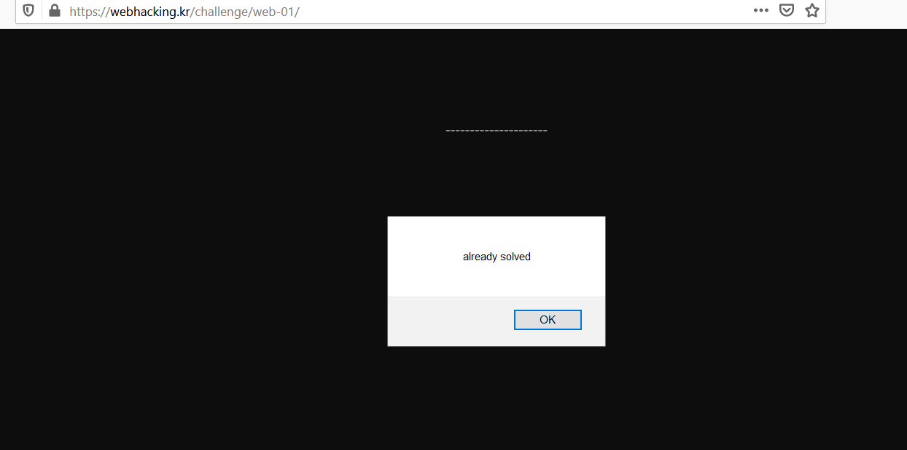

## Old-01 (200)

- Ta có đoạn source:
```php
if(!is_numeric($_COOKIE['user_lv'])) $_COOKIE['user_lv']=1;
  if($_COOKIE['user_lv']>=6) $_COOKIE['user_lv']=1;
  if($_COOKIE['user_lv']>5) solve(1);
  echo "<br>level : {$_COOKIE['user_lv']}";

```
- Đọc source ta thấy, nếu trường cookie user_lv > 5 and user_lv < 6 thì chall sẽ được giải. Vậy ta gán user_lv trong khoảng đó là ra.

  
  