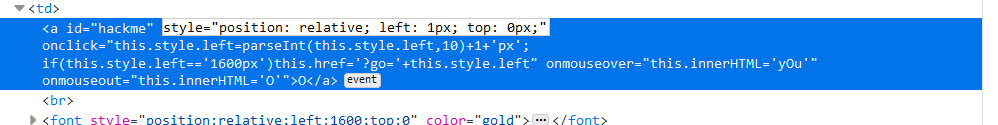
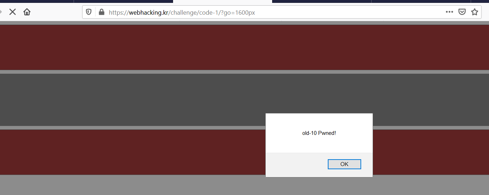

## old - 10

- Ctrl + U thì thấy đoạn code js, kiểu như bài này bắt mình click vào cái thẻ a, mỗi lần click đi bên về phải 1 px, cho đến vạch đích thì ok.

  

- Mình sửa thành 1600px (để về đích) thì nó hiện ra chữ nohack. Kiểu như nó bắt hành động của mình là phải click tới đích mới hợp lệ. Thế thì 
phải click đến 1600 lần ư ? Không đâu. Mình sẽ sửa 1599px thôi, rồi cái cuối cùng mình click thế là qua màn

  
  