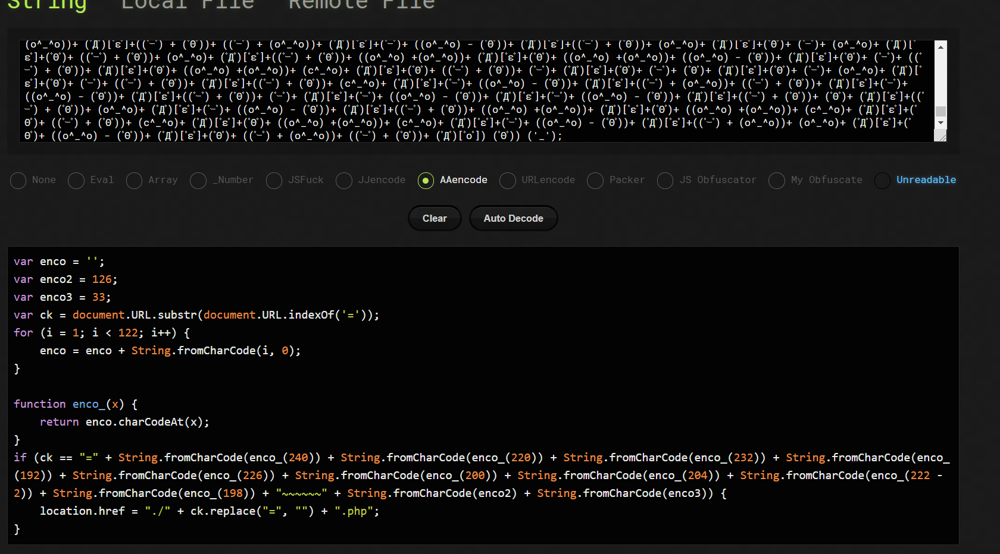
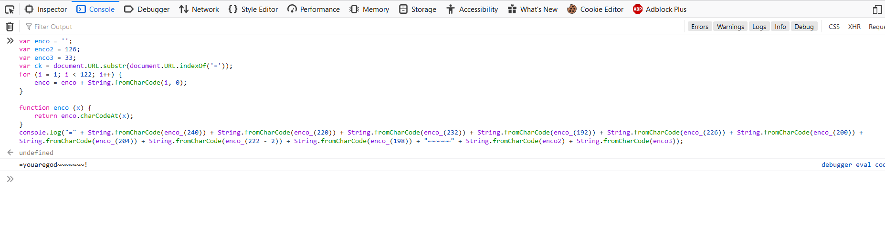
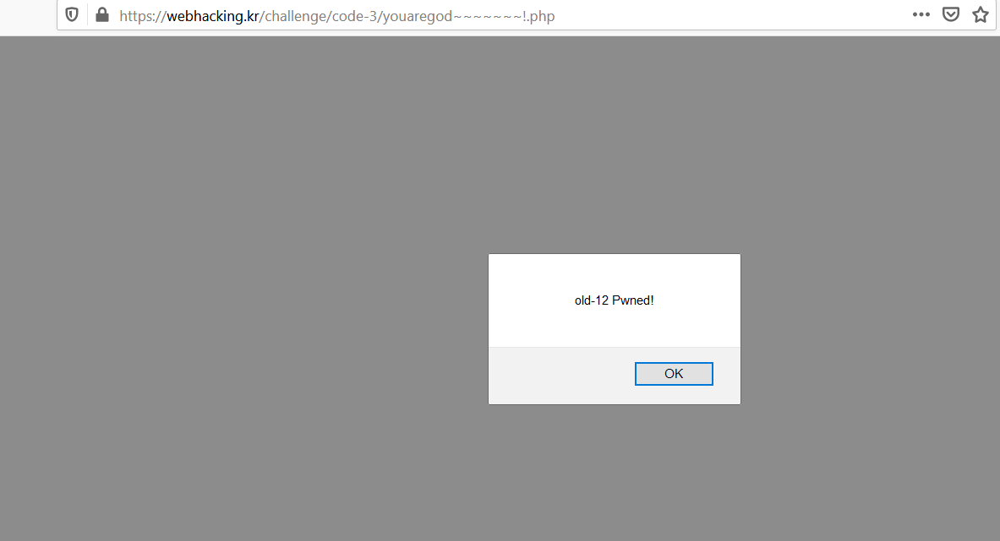

## old - 12 

- Vào view page source thì thấy đoạn script js obfuscator, deobfuscator tool online, ta được đoạn code.



```javascript
var enco = '';
var enco2 = 126;
var enco3 = 33;
var ck = document.URL.substr(document.URL.indexOf('='));
for (i = 1; i < 122; i++) {
    enco = enco + String.fromCharCode(i, 0);
}

function enco_(x) {
    return enco.charCodeAt(x);
}
if (ck == "=" + String.fromCharCode(enco_(240)) + String.fromCharCode(enco_(220)) + String.fromCharCode(enco_(232)) + String.fromCharCode(enco_(192)) + String.fromCharCode(enco_(226)) + String.fromCharCode(enco_(200)) + String.fromCharCode(enco_(204)) + String.fromCharCode(enco_(222 - 2)) + String.fromCharCode(enco_(198)) + "~~~~~~" + String.fromCharCode(enco2) + String.fromCharCode(enco3)) {
    location.href = "./" + ck.replace("=", "") + ".php";
}
```

- console lên test thử, ta sửa lại đoạn code và bỏ vào console để hiện đoạn url cần thêm vào để solve bài này.

  

  ta được: =youaregod~~~~~~~!

  solved ~.~

  
