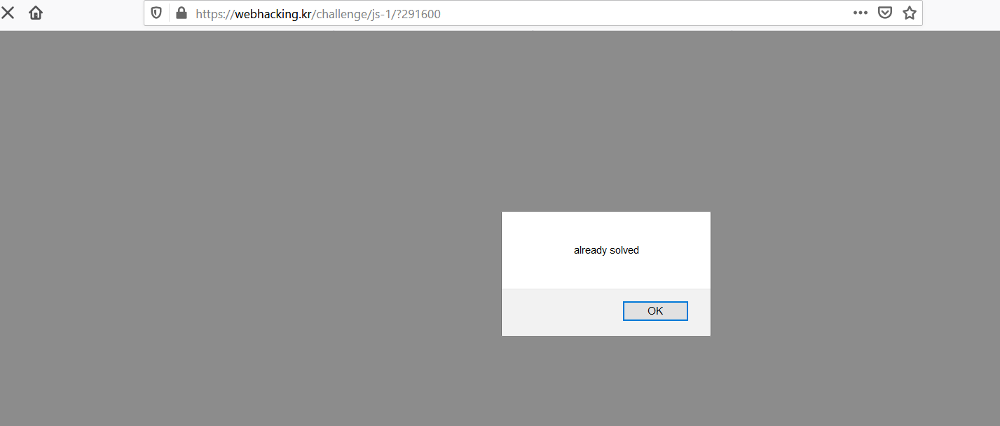

## old-14

- Xem source, khi click vào button check thì hàm ck thực thi

```javascript
var ul=document.URL;
  ul=ul.indexOf(".kr");
  ul=ul*30;
  if(ul==pw.input_pwd.value) { location.href="?"+ul*pw.input_pwd.value; }
  else { alert("Wrong"); }
```

- Lấy url đang truy cập, vị trí của .kr chuỗi rồi nhân cho 30, khi ta nhập đúng giá trị thì qua màn. Test thử ra 540 

- Bingo

