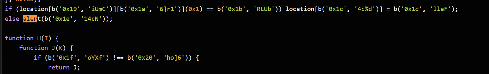
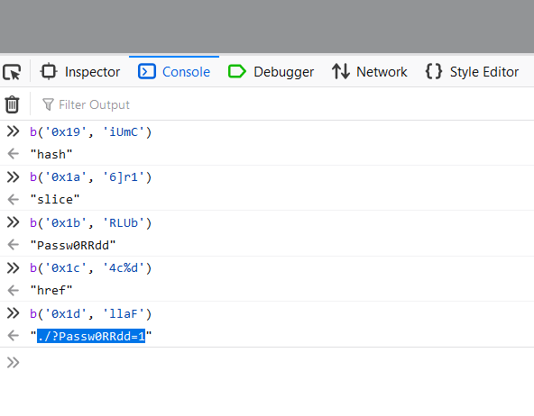
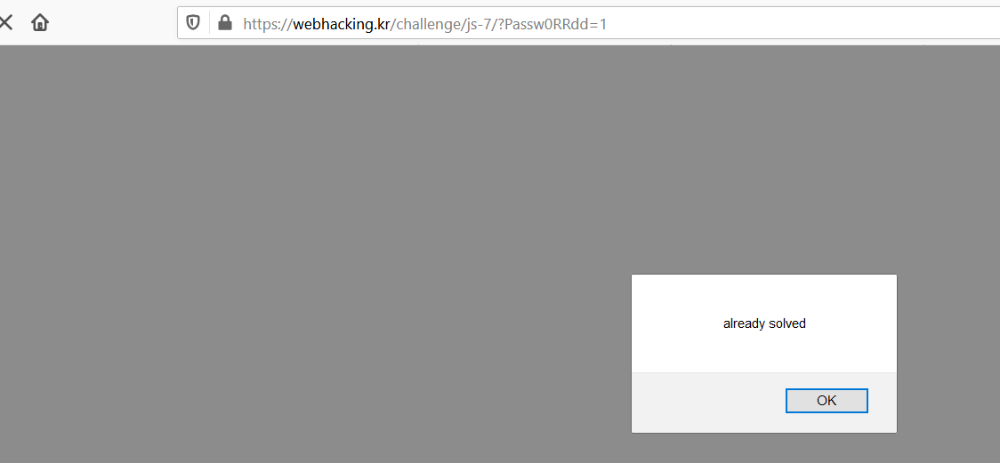

## old - 34

- View page source ta thấy đoạn js obfuscator, deobfuscator ta được đoạn code, để ý khi ta vào web lúc đầu nó hiện lên cái alert("debug me")
  thế nên ta sẽ find alert trong đoạn code vừa có. Ta được

  

- Ta thử dán các giá trị đó vào console xem ra gì

  

- Ta thấy dòng cuối ra : "./?Passw0RRdd=1"
  thử truy cập thì chall đã solve.

  
  