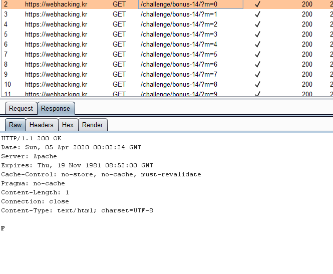
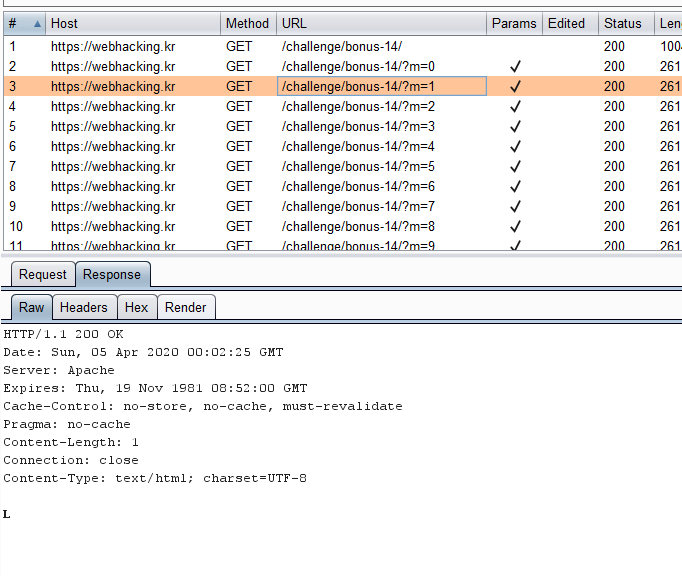
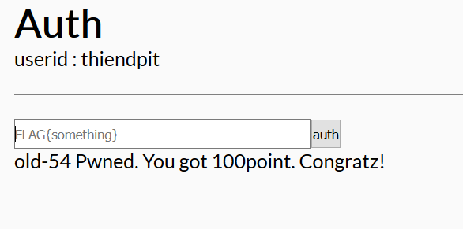

## old - 54

- View page source ta thấy bài này đại ý dùng setTimeout trong js, mỗi 1 giây trả về res có địng dạng /challenge/bonus-14/?m=..
 lần lượt m = 0,1,2,3,4... cho đến khi in ra hết đoạn flag.

 

 

- việc mình cần làm là nối lại cái chữ đó để thành flag.

FLAG{a7981201c48d0ece288afd01ca43c55b}

- Submit

 
